# BÁO CÁO PHẦN NGƯỜI B — Backend API, DynamoDB, API Gateway, Luồng Request & Auto-Scaling

---

## PHẦN 1: THIẾT KẾ BACKEND API — AWS LAMBDA

### 1.1. Ngôn ngữ và Runtime

Backend sử dụng **Node.js 22.x** làm ngôn ngữ lập trình, triển khai dưới dạng module ESM (ECMAScript Modules — sử dụng `import/export` thay vì `require`). File mã nguồn sử dụng phần mở rộng `.mjs` để Node.js tự động nhận diện đây là module ESM.

**Lý do chọn Node.js 22.x:**

- Do Node.js 20.x không còn hỗ trợ trên amazon nên sử dụng Node.js 22.x.
- Node.js có hệ sinh thái phong phú với AWS SDK v3 được tích hợp sẵn trong môi trường Lambda (không cần cài thêm dependencies).
- Xử lý bất đồng bộ (async/await) rất phù hợp với thao tác gọi DynamoDB — Lambda không bị block chờ kết quả mà có thể xử lý song song nhiều tác vụ.

### 1.2. Kiến trúc 4 Lambda Functions riêng biệt

Đề bài yêu cầu rõ ràng (Mục IV.2.2): _"Bắt buộc triển khai 4 Lambda Function riêng biệt [...] Không được phép gộp chung nhiều chức năng vào một Lambda duy nhất."_

Hệ thống gồm 4 hàm Lambda độc lập, mỗi hàm đảm nhận đúng một chức năng CRUD:

| Lambda Function          | HTTP Method | Endpoint     | Chức năng chính                                 | DynamoDB Operation              |
| ------------------------ | ----------- | ------------ | ----------------------------------------------- | ------------------------------- |
| `TaskManager-GetTasks`   | GET         | `/tasks`     | Lấy danh sách công việc của user đang đăng nhập | `Query` trên GSI `userId-index` |
| `TaskManager-CreateTask` | POST        | `/tasks`     | Tạo công việc mới                               | `PutItem`                       |
| `TaskManager-UpdateTask` | PUT         | `/tasks/:id` | Cập nhật nội dung công việc                     | `UpdateItem`                    |
| `TaskManager-DeleteTask` | DELETE      | `/tasks/:id` | Xóa công việc                                   | `DeleteItem`                    |

### 1.3. Cấu trúc thư mục mã nguồn Backend

```
backend/
├── getTasksFunction/
│   └── index.mjs       ← Handler GET /tasks (68 dòng code)
├── createTaskFunction/
│   └── index.mjs       ← Handler POST /tasks (115 dòng code)
├── updateTaskFunction/
│   └── index.mjs       ← Handler PUT /tasks/:id (178 dòng code)
├── deleteTaskFunction/
│   └── index.mjs       ← Handler DELETE /tasks/:id (86 dòng code)
└── seed.mjs            ← Script bơm dữ liệu mẫu cho 2 users (87 dòng code)
```

### 1.4. Phân tích chi tiết từng Lambda Function

#### a) GetTasksFunction — GET /tasks

**Luồng xử lý:**

1. Nhận sự kiện (event) từ API Gateway.
2. Kiểm tra và xử lý request preflight OPTIONS (cho CORS).
3. Trích xuất `userId` từ JWT Token thông qua `event.requestContext.authorizer.claims.sub`. Đây là ID duy nhất (UUID) mà Cognito tự động tạo cho mỗi user khi họ đăng ký. Việc lấy `userId` từ Token (chứ không từ query parameter do client gửi) đảm bảo **bảo mật tuyệt đối** — user không thể giả mạo ID để xem công việc của người khác.
4. Gọi DynamoDB `QueryCommand` trên **GSI `userId-index`** với điều kiện `userId = :uid`. GSI (Global Secondary Index) cho phép truy vấn hiệu quả tất cả task thuộc một user mà không cần quét (Scan) toàn bộ bảng. Nếu không có GSI, mỗi lần lấy danh sách phải Scan hàng triệu bản ghi (nếu có) → cực kỳ chậm và tốn Read Capacity Units.
5. Trả về danh sách tasks dạng JSON với status 200.

**Các biến môi trường (Environment Variables) sử dụng:**

- `TABLE_NAME`: Tên bảng DynamoDB (mặc định: `TasksTable`).
- `ALLOWED_ORIGIN`: Domain CloudFront để cấu hình CORS header (mặc định fallback: `*` — phải đổi trước khi nộp bài).

#### b) CreateTaskFunction — POST /tasks

**Luồng xử lý:**

1. Trích xuất `userId` từ Cognito Token (tương tự trên).
2. Parse body JSON từ request.
3. **Validation (Kiểm tra dữ liệu đầu vào):**
   - `title` (Tiêu đề): Bắt buộc phải có, không được rỗng.
   - `priority` (Mức ưu tiên): Nếu có, phải nằm trong danh sách `['low', 'medium', 'high']`.
   - `status` (Trạng thái): Nếu có, phải là `'pending'` hoặc `'done'`.
   - Nếu vi phạm bất kỳ điều kiện nào → trả về status 400 kèm thông báo lỗi bằng tiếng Việt.
4. **Tự động sinh các trường hệ thống:**
   - `taskId`: UUID ngẫu nhiên tạo bởi `crypto.randomUUID()` (module crypto tích hợp sẵn trong Node.js 22.x). Đây chính là Partition Key của bảng DynamoDB.
   - `createdAt`: Timestamp ở định dạng ISO 8601 (`new Date().toISOString()`), ví dụ: `"2026-06-03T16:30:00.000Z"`.
5. Ghi bản ghi mới vào DynamoDB bằng `PutCommand`.
6. Trả về object task vừa tạo với status 201 (Created).

#### c) UpdateTaskFunction — PUT /tasks/:id

Đây là hàm phức tạp nhất (178 dòng code) vì phải xử lý logic **cập nhật động (dynamic update)**: client có thể gửi lên 1 trường (chỉ đổi title) hoặc 5 trường cùng lúc (đổi tất cả). Lambda phải tự động xây dựng câu `UpdateExpression` phù hợp.

**Luồng xử lý:**

1. Trích xuất `userId` và `taskId` (từ URL path parameter `event.pathParameters.id`).
2. Parse body và kiểm tra từng trường nào được gửi lên:
   - Nếu `body.title` tồn tại → thêm `#title = :title` vào UpdateExpression.
   - Nếu `body.description` tồn tại → thêm `#desc = :desc`.
   - Tương tự cho `priority`, `dueDate`, `status`.
   - Nếu không có trường nào → trả về 400 "Không có thông tin nào để cập nhật".
3. **Bảo mật quan trọng — ConditionExpression:** Câu lệnh update kèm theo `ConditionExpression: 'userId = :uid'`. Điều này có nghĩa: DynamoDB sẽ **từ chối cập nhật** nếu bản ghi đó không thuộc về user đang đăng nhập. Nếu User A cố sửa task của User B → DynamoDB ném lỗi `ConditionalCheckFailedException` → Lambda bắt lỗi và trả về status 403 "Không có quyền sửa".
4. `ReturnValues: 'ALL_NEW'`: Sau khi update thành công, DynamoDB trả về toàn bộ bản ghi đã được cập nhật (bao gồm cả các trường không thay đổi) → Lambda trả về cho frontend để cập nhật giao diện.

#### d) DeleteTaskFunction — DELETE /tasks/:id

**Luồng xử lý tương tự UpdateTask nhưng đơn giản hơn:**

1. Trích xuất `userId` và `taskId`.
2. Gọi `DeleteCommand` với `ConditionExpression: 'userId = :uid'` — đảm bảo chỉ xóa được task của chính mình.
3. Trả về status 200 kèm thông báo thành công.

### 1.5. Cấu hình CORS trong Lambda

Tất cả 4 Lambda đều trả về CORS headers trong mỗi response:

```javascript
const corsHeaders = {
  "Content-Type": "application/json",
  "Access-Control-Allow-Origin": ALLOWED_ORIGIN,
  "Access-Control-Allow-Headers": "Content-Type,Authorization",
  "Access-Control-Allow-Methods": "GET,POST,PUT,DELETE,OPTIONS",
};
```

**Quan trọng:** Giá trị `ALLOWED_ORIGIN` phải được cấu hình thành **domain CloudFront cụ thể** (ví dụ: `https://d1abc123.cloudfront.net`) thông qua biến môi trường trong AWS Lambda Console. Đề bài cấm tuyệt đối sử dụng `*` (Mục IV.6.3).

Domain CloudFront thực tế đã cấu hình: `https://d35022l8np0raz.cloudfront.net`

### 1.6. Cấu hình VPC cho Lambda

Cả 4 Lambda đều được đặt vào trong Custom VPC mà Người C đã tạo, nhằm đảm bảo kết nối đến DynamoDB đi qua VPC Gateway Endpoint (mạng riêng của AWS) thay vì internet công cộng.

| Cấu hình VPC   | Giá trị                                                                                                      |
| -------------- | ------------------------------------------------------------------------------------------------------------ |
| VPC            | `TaskManager-VPC` (`vpc-05b264cc9493d2647`)                                                                  |
| Subnets        | `TaskManager-Private-1a` (`subnet-08e6506eab738c2bf`), `TaskManager-Private-1b` (`subnet-0c0301111264e4df6`) |
| Security Group | `TaskManager-Lambda-SG` (`sg-067341212dbf69317`)                                                             |

- **Minh họa VPC Configuration của các Lambda (NE-2):**
  - **TaskManager-GetTasks VPC:**
    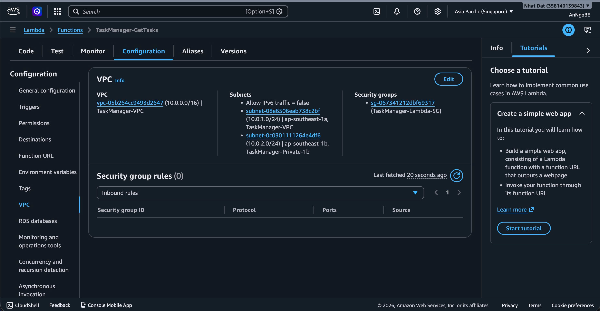
  - **TaskManager-CreateTask VPC:**
    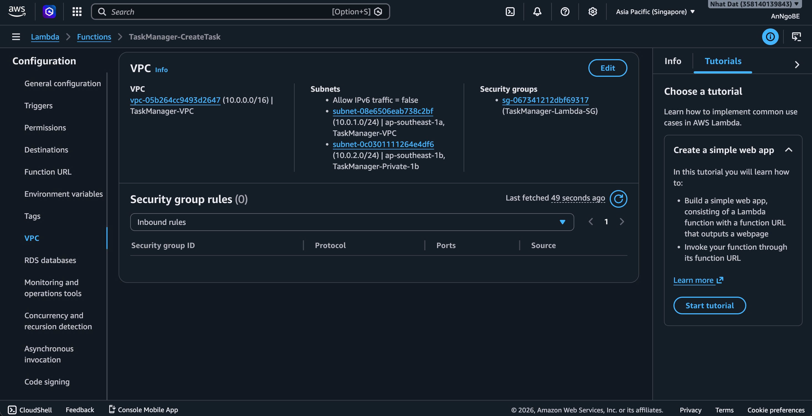
  - **TaskManager-UpdateTask VPC:**
    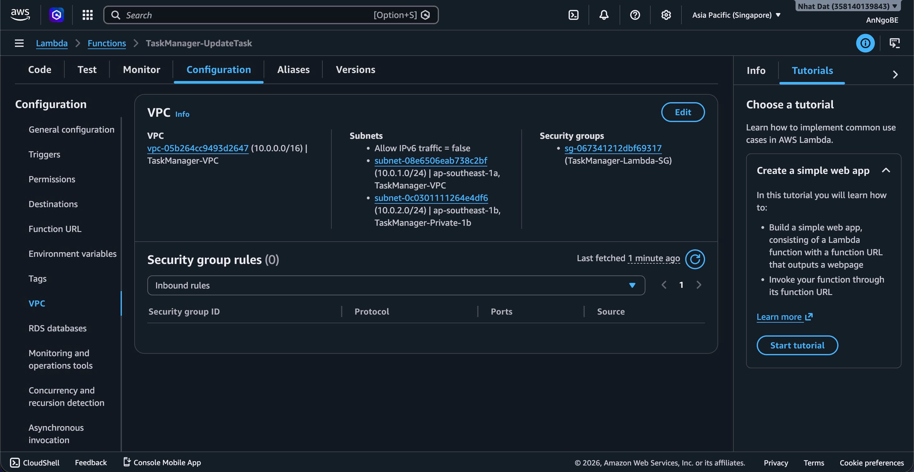
  - **TaskManager-DeleteTask VPC:**
    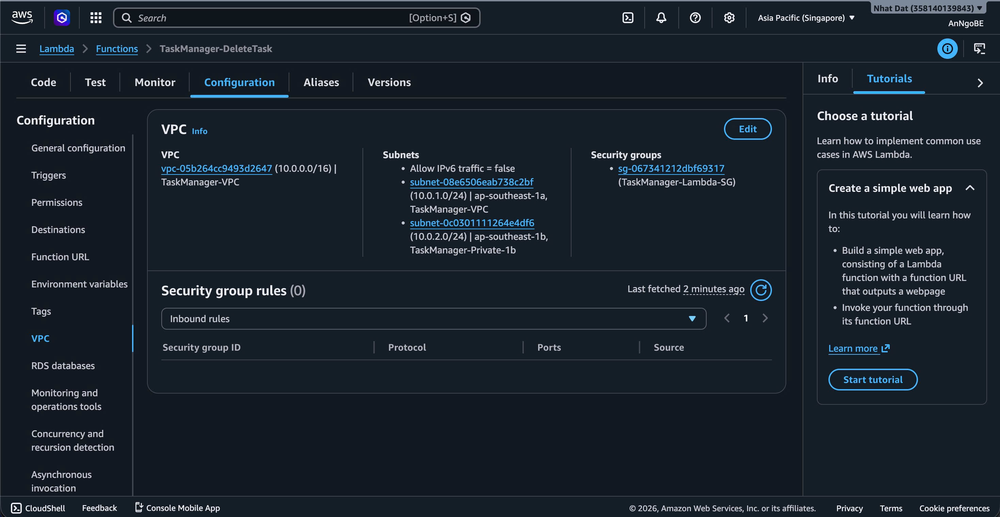

- **Minh họa IAM Execution Role của các Lambda (IM-3):**
  - **TaskManager-GetTasks Permissions:**
    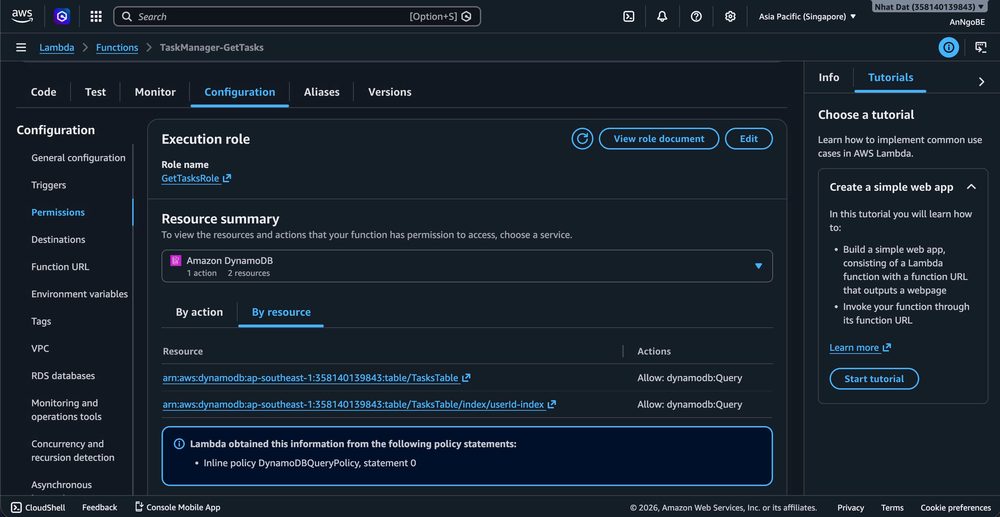
  - **TaskManager-CreateTask Permissions:**
    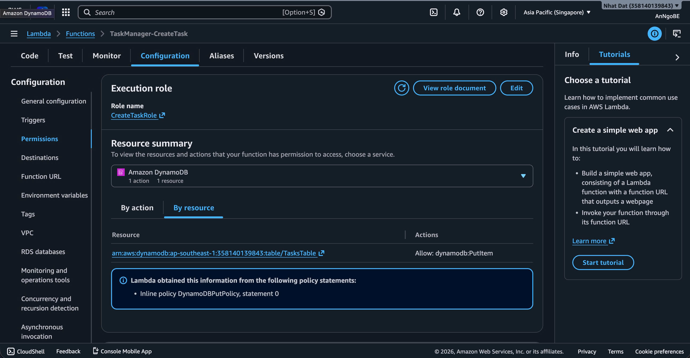
  - **TaskManager-UpdateTask Permissions:**
    
  - **TaskManager-DeleteTask Permissions:**
    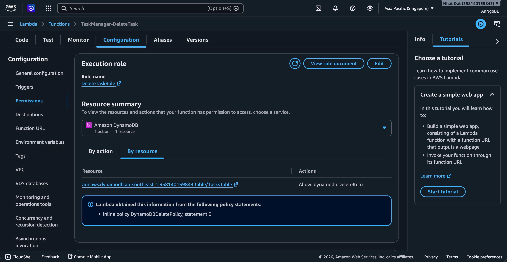

---

## PHẦN 2: CƠ SỞ DỮ LIỆU — AMAZON DYNAMODB

### 2.1. Tại sao chọn DynamoDB?

Amazon DynamoDB là dịch vụ cơ sở dữ liệu NoSQL phi máy chủ (serverless) hoàn toàn được AWS quản lý. Nó phù hợp tuyệt đối với kiến trúc serverless của dự án vì:

- **Không cần quản trị server:** Không phải cài đặt, vá lỗi (patch), hay sao lưu (backup) thủ công.
- **High Availability tích hợp sẵn:** DynamoDB tự động sao chép dữ liệu trên nhiều Availability Zones (AZ) trong cùng một Region. Nếu một AZ gặp sự cố, dữ liệu vẫn được phục vụ bình thường từ AZ còn lại — hoàn toàn không cần cấu hình failover.
- **Free Tier không hết hạn:** 25 GB lưu trữ, 25 RCU (Read Capacity Units) và 25 WCU (Write Capacity Units) mỗi tháng — miễn phí vĩnh viễn. Với quy mô đồ án này (vài chục bản ghi), nhóm hoàn toàn không phát sinh chi phí.

### 2.2. Schema bảng dữ liệu

**Tên bảng:** `TasksTable`

| Thuộc tính    | Kiểu   | Vai trò               | Mô tả & Ý nghĩa                                                                                                                                                                                        |
| ------------- | ------ | --------------------- | ------------------------------------------------------------------------------------------------------------------------------------------------------------------------------------------------------ |
| `taskId`      | String | **Partition Key**     | Chuỗi UUID v4 duy nhất (ví dụ: `"f47ac10b-58cc-4372-a567-0e02b2c3d479"`). Mỗi công việc có một taskId riêng, không bao giờ trùng lặp. Lambda tự động sinh bằng `crypto.randomUUID()` khi tạo task mới. |
| `userId`      | String | **GSI Partition Key** | Là `sub` claim từ Cognito JWT Token — UUID đại diện cho người sở hữu task. Đảm bảo mỗi user chỉ thấy task của mình.                                                                                    |
| `title`       | String | Thuộc tính bắt buộc   | Tiêu đề công việc (tối đa 200 ký tự).                                                                                                                                                                  |
| `description` | String | Thuộc tính tùy chọn   | Chi tiết công việc, có thể để trống.                                                                                                                                                                   |
| `priority`    | String | Thuộc tính            | Mức ưu tiên, chỉ nhận 3 giá trị: `"low"`, `"medium"`, `"high"`.                                                                                                                                        |
| `dueDate`     | String | Thuộc tính            | Ngày hết hạn, định dạng ISO: `"2026-06-15"`.                                                                                                                                                           |
| `status`      | String | Thuộc tính            | Trạng thái, chỉ nhận 2 giá trị: `"pending"` (đang chờ) hoặc `"done"` (hoàn thành).                                                                                                                     |
| `createdAt`   | String | Thuộc tính            | Timestamp ISO 8601 ghi lại thời điểm tạo task: `"2026-06-03T16:30:00.000Z"`.                                                                                                                           |

### 2.3. Global Secondary Index (GSI)

| Cấu hình GSI  | Giá trị                                       |
| ------------- | --------------------------------------------- |
| Tên index     | `userId-index`                                |
| Partition Key | `userId` (String)                             |
| Sort Key      | Không có                                      |
| Projection    | `ALL` (sao chép toàn bộ thuộc tính vào index) |

**Tại sao cần GSI?**
Bảng DynamoDB chính có Partition Key là `taskId`. Nếu muốn lấy "tất cả task của user X", không có cách nào query trực tiếp trên bảng chính (vì Partition Key là `taskId`, không phải `userId`). Nếu không có GSI, hệ thống buộc phải thực hiện `Scan` toàn bộ bảng rồi lọc → tốn tài nguyên, chậm, và không đáp ứng yêu cầu kiến trúc.

GSI `userId-index` tạo ra một "bản sao ảo" của bảng với Partition Key là `userId`, cho phép hàm `GetTasksFunction` thực hiện `Query` cực kỳ hiệu quả: _"Trả về tất cả bản ghi có userId = X"_ — chỉ quét đúng phân vùng của user đó thay vì toàn bộ bảng.

### 2.4. Dữ liệu mẫu (Seed Data)

Đề bài yêu cầu (Mục IV.4): _"Cơ sở dữ liệu phải được khởi tạo sẵn ít nhất 2 users để phục vụ demo."_

File `seed.mjs` chứa script bơm 4 task mẫu cho 2 user:

- **User 1** (2 tasks): "Hoàn thành báo cáo môn Cloud" (priority: high, status: pending) và "Họp nhóm đồ án" (priority: medium, status: done).
- **User 2** (2 tasks): "Cài đặt AWS CLI" (priority: high) và "Tìm hiểu về Cognito" (priority: low).

_Lưu ý:_ Giá trị `USER_1` và `USER_2` trong script `seed.mjs` đã được cấu hình tương ứng với trường `sub` (UUID) thực tế của 2 người dùng được tạo trên Amazon Cognito User Pool để thực hiện việc phân quyền dữ liệu (Data Isolation) chính xác.

---

## PHẦN 3: API GATEWAY — ĐỊNH TUYẾN VÀ BẢO MẬT

### 3.1. Cấu hình API Gateway

| Cấu hình   | Giá trị                                                            |
| ---------- | ------------------------------------------------------------------ |
| Loại API   | **REST API** (không phải HTTP API — đề bài cấm)                    |
| Tên API    | `TaskManager-API`                                                  |
| Stage      | `prod`                                                             |
| Invoke URL | `https://owuatkgwh3.execute-api.ap-southeast-1.amazonaws.com/prod` |
| HTTPS      | Tự động (API Gateway cấp SSL certificate)                          |

### 3.2. Bảng Route — Ánh xạ endpoint tới Lambda

| Method  | Resource Path | Lambda Integration                  | Cognito Authorizer |
| ------- | ------------- | ----------------------------------- | ------------------ |
| GET     | `/tasks`      | `TaskManager-GetTasks`              | ✅ Có              |
| POST    | `/tasks`      | `TaskManager-CreateTask`            | ✅ Có              |
| PUT     | `/tasks/{id}` | `TaskManager-UpdateTask`            | ✅ Có              |
| DELETE  | `/tasks/{id}` | `TaskManager-DeleteTask`            | ✅ Có              |
| OPTIONS | `/tasks`      | Mock Integration (trả CORS headers) | ❌ Không           |
| OPTIONS | `/tasks/{id}` | Mock Integration (trả CORS headers) | ❌ Không           |

> **Giải thích OPTIONS:** Khi trình duyệt gửi request cross-origin (từ CloudFront domain tới API Gateway domain), trước mỗi request thực sự (GET, POST, PUT, DELETE), trình duyệt sẽ gửi một request "tiền kiểm" (preflight) bằng phương thức OPTIONS để hỏi: _"Server ơi, tôi có được phép gửi request từ domain này không?"_. API Gateway cần trả về CORS headers ở bước OPTIONS này. Phương thức OPTIONS **KHÔNG** cần Cognito Authorizer vì nó chỉ là bước kiểm tra, không truy cập dữ liệu.

### 3.3. Cognito Authorizer trên API Gateway

| Cấu hình Authorizer | Giá trị                                             |
| ------------------- | --------------------------------------------------- |
| Tên                 | `TaskManager-CognitoAuthorizer`                     |
| Type                | **Cognito**                                         |
| Cognito User Pool   | `TaskManager-UserPool` (`ap-southeast-1_XPD5UXGns`) |
| Token Source        | `Authorization` header                              |

**Cơ chế hoạt động:** Khi client gửi request kèm header `Authorization: <JWT_Token>`, API Gateway tự động:

1. Giải mã (decode) JWT Token.
2. Xác minh chữ ký (signature) bằng public key của Cognito User Pool.
3. Kiểm tra token chưa hết hạn (trường `exp`).
4. Nếu hợp lệ → cho phép request đi tiếp vào Lambda. Token payload (chứa `sub`, `email`) được truyền vào `event.requestContext.authorizer.claims`.
5. Nếu không hợp lệ (token sai, hết hạn, hoặc thiếu) → API Gateway tự động chặn và trả về **401 Unauthorized** mà không cần Lambda xử lý.

- **Minh họa cấu hình Cognito Authorizer trên API Gateway (CO-2):**
  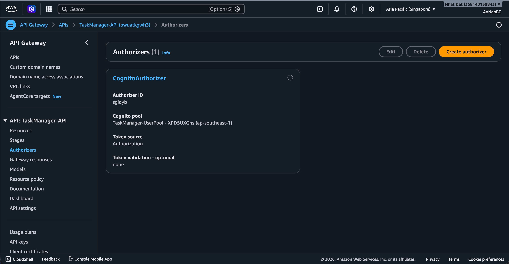

### 3.4. Throttling (Giới hạn tốc độ)

| Tham số | Giá trị đã cấu hình | Giải thích                                                                                         |
| ------- | ------------------- | -------------------------------------------------------------------------------------------------- |
| Rate    | 100 req/s           | Số request tối đa mỗi giây. Với quy mô đồ án (vài user), con số 100 là quá đủ.                     |
| Burst   | 50                  | Số request đồng thời tối đa tại một thời điểm. API Gateway sẽ xếp hàng các request vượt quá burst. |

### 3.5. Lambda Reserved Concurrency

Dưới đây là phần giải trình chi tiết về cấu hình Concurrency cho các hàm Lambda trong hệ thống:

**Câu 1: Reserved Concurrency là gì?**
Reserved Concurrency là số lượng tối đa các "bản sao" (instances) của một Lambda function có thể chạy đồng thời tại một thời điểm. Nó giữ lại một phần quota concurrency của region cho riêng function đó và ngăn không cho function đó vượt quá giới hạn đã đặt. Ví dụ: nếu cấu hình Reserved Concurrency = 5 cho hàm `GetTasks`, thì tối đa chỉ có 5 request `GET /tasks` được xử lý cùng lúc. Nếu có request thứ 6 đến đồng thời, nó sẽ bị throttle ngay lập tức và API Gateway trả về lỗi `429 Too Many Requests`.

**Câu 2: Giá trị nào phù hợp với môi trường Free Tier?**
Tài khoản AWS Free Tier có tổng giới hạn mặc định là 1000 concurrent executions trên toàn bộ region. Đối với hệ thống demo quy mô nhỏ và chạy trên Free Tier, việc đặt Reserved Concurrency từ **5 đến 10** cho mỗi function là hoàn toàn hợp lý. Mức này vừa đủ để phục vụ demo từ vài người dùng truy cập đồng thời mà không chiếm hết quota region, giúp tránh ảnh hưởng chéo đến các Lambda function khác đang chạy trong cùng tài khoản AWS.

**Câu 3: Ảnh hưởng nếu đặt quá thấp hoặc quá cao?**

- **Nếu đặt quá thấp (ví dụ: 1 hoặc 2):** Khả năng xử lý đồng thời của hệ thống cực kỳ hạn chế. Chỉ cần 2-3 người dùng thao tác cùng lúc, hệ thống sẽ trả về lỗi `429 Too Many Requests`. Trải nghiệm người dùng sẽ rất kém và hệ thống thường xuyên bị gián đoạn.
- **Nếu đặt quá cao (ví dụ: 500 hoặc sát 1000):** Sẽ chiếm dụng phần lớn quota concurrency dùng chung của cả region. Khi có sự cố bùng nổ traffic hoặc bị tấn công DDoS, Lambda sẽ tự động khởi tạo hàng trăm instances đồng thời, dẫn đến phát sinh chi phí khổng lồ vượt xa hạn mức của AWS Free Tier. Hơn nữa, nó có thể gây cạn kiệt tài nguyên dùng chung, làm tê liệt các ứng dụng Lambda khác trong cùng tài khoản.

---

## PHẦN 4: GIẢI THÍCH KHÁI NIỆM — LUỒNG ĐI CỦA REQUEST (~8% tổng điểm)

### Mô tả chi tiết luồng Request khi người dùng bấm "Tạo công việc"

Dưới đây là mô tả **từng bước** dữ liệu di chuyển từ khi người dùng bấm nút trên trình duyệt đến khi nhận được phản hồi:

**Bước 1 — Trình duyệt gửi request:**
Khi người dùng điền form "Tạo công việc" và bấm nút Submit, mã JavaScript trong file `app.js` gọi hàm `createTask(taskData)` (file `api.js`). Hàm này tạo một HTTP request với:

- Method: `POST`
- URL: `https://owuatkgwh3.execute-api.ap-southeast-1.amazonaws.com/prod/tasks`
- Headers: `Authorization: <JWT Token từ Cognito>`, `Content-Type: application/json`
- Body: `{ "title": "...", "priority": "medium", ... }`

**Bước 2 — API Gateway tiếp nhận:**
Request tới API Gateway (REST API). API Gateway thực hiện 3 bước theo thứ tự:

1. **Kiểm tra Throttling:** Request có vượt giới hạn tốc độ (100 req/s, burst 50) không? Nếu vượt → trả về 429 Too Many Requests.
2. **Kiểm tra Cognito Authorizer:** Giải mã và xác minh JWT Token trong header Authorization. Nếu token không hợp lệ hoặc hết hạn → trả về 401 Unauthorized ngay tại đây, Lambda **không bao giờ** được kích hoạt.
3. **Route tới Lambda:** Nếu cả 2 bước trên pass, API Gateway kích hoạt Lambda function `TaskManager-CreateTask` và truyền toàn bộ thông tin request (headers, body, path, authorizer claims) vào tham số `event`.

**Bước 3 — Lambda xử lý bên trong VPC:**
Lambda function `TaskManager-CreateTask` khởi chạy bên trong **Private Subnet** của Custom VPC (nhờ cấu hình VpcConfig). Nó thực hiện:

1. Trích xuất `userId` từ `event.requestContext.authorizer.claims.sub`.
2. Validate dữ liệu (kiểm tra title, priority, status).
3. Sinh `taskId` (UUID) và `createdAt` (ISO timestamp).
4. Tạo object task hoàn chỉnh.

**Bước 4 — Lambda gọi DynamoDB qua VPC Gateway Endpoint:**
Lambda gửi lệnh `PutItem` tới DynamoDB. Vì Lambda nằm trong Private Subnet (không có đường ra internet), traffic **đi qua VPC Gateway Endpoint** — một đường hầm riêng tư trên backbone nội bộ của AWS. Traffic **KHÔNG BAO GIỜ** đi qua internet công cộng. Route Table của Private Subnet có entry:

```
Destination: pl-xxxxxx (DynamoDB Prefix List) → Target: vpce-xxxxxxxx (Gateway Endpoint)
```

**Bước 5 — DynamoDB lưu bản ghi:**
DynamoDB nhận lệnh PutItem, lưu bản ghi mới vào bảng `TasksTable`. DynamoDB tự động sao chép bản ghi này ra ít nhất 3 AZ (Availability Zones) trong Region Singapore để đảm bảo High Availability. Sau khi hoàn tất → trả kết quả thành công về cho Lambda.

**Bước 6 — Lambda trả response:**
Lambda nhận xác nhận từ DynamoDB → tạo HTTP response với status 201, CORS headers, và body chứa object task vừa tạo (dạng JSON) → trả về API Gateway.

**Bước 7 — API Gateway chuyển tiếp response về trình duyệt:**
API Gateway nhận response từ Lambda → chuyển tiếp nguyên vẹn về trình duyệt của người dùng.

**Bước 8 — Trình duyệt cập nhật giao diện:**
JavaScript trong `app.js` nhận response thành công → hiển thị Toast notification "Đã tạo công việc mới thành công!" → gọi `loadTasks()` để tải lại danh sách → giao diện tự động cập nhật.

### 4.2. Sơ đồ tuần tự (Sequence Diagram) minh họa luồng đi của request:

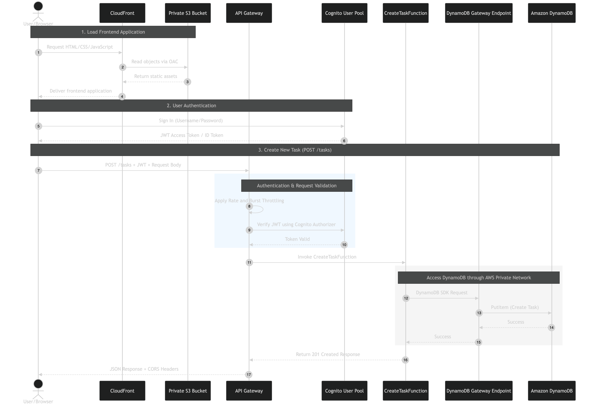

---

## PHẦN 5: GIẢI THÍCH KHÁI NIỆM — TỰ MỞ RỘNG SERVERLESS (~6% tổng điểm)

### 5.1. Lambda tự mở rộng từ 0 đến N instances

AWS Lambda hoạt động theo mô hình **"scale to zero"** — khi không có request nào, không có bất kỳ máy chủ hoặc instance nào chạy, chi phí = 0. Khi có request đến:

1. **1 request:** AWS tạo 1 instance (container) để xử lý. Gọi là "cold start" — lần đầu chậm hơn một chút (vài trăm ms) do phải khởi tạo môi trường runtime.
2. **10 request đồng thời:** AWS tạo thêm 9 instance nữa (tổng cộng 10) để xử lý song song. Mỗi instance xử lý 1 request.
3. **1000 request đồng thời:** AWS tạo 1000 instances. Tất cả tự động và hoàn toàn không cần cấu hình.
4. **Hết giờ cao điểm, request giảm về 0:** AWS từ từ tắt các instances không dùng → chi phí trở về 0.

Khả năng này gọi là **auto-scaling** — Lambda tự co giãn theo nhu cầu thực tế, không cần cài đặt ngưỡng hay quy tắc scale.

### 5.2. API Gateway đóng vai trò Load Balancer tự nhiên

Trong kiến trúc truyền thống (sử dụng máy ảo EC2), cần phải cấu hình **Application Load Balancer (ALB)** để phân phối request đến nhiều EC2 instances. Tuy nhiên, trong kiến trúc serverless, **API Gateway tự động đảm nhận vai trò này**:

- API Gateway tiếp nhận tất cả request từ client.
- Với mỗi request, nó kích hoạt một Lambda instance tương ứng.
- Nếu có 100 request đồng thời → API Gateway kích hoạt 100 Lambda instances song song — hoàn toàn tự động, không cần cấu hình thêm bất kỳ thứ gì.

**Tại sao không cần ALB?**

- ALB có chi phí cố định (~$16/tháng) dù không có traffic → vi phạm mục tiêu Free Tier.
- API Gateway đã tích hợp sẵn: HTTPS, throttling, authentication (qua Cognito Authorizer), request routing → thay thế hoàn toàn vai trò của ALB.
- Lambda tự scale → không cần ALB để phân phối tải giữa các EC2 instances (vì không có EC2 instances nào cả).

---

## PHẦN 6: BẰNG CHỨNG LOG — CLOUDWATCH

### 6.1. Log Request thành công (NE-5)

- **Bằng chứng CloudWatch Log ghi nhận gọi DynamoDB thành công (NE-5):**
  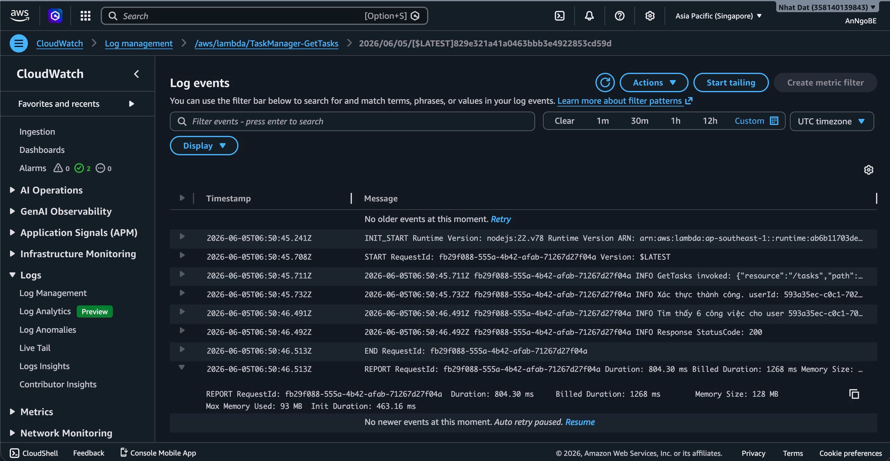

* `StatusCode 200` (hoặc `200` trong dòng log do code in ra)
* `Duration: xxx ms`
* `Billed Duration: xxx ms`
* `Memory Used: xxx MB`
* Không có dòng `ERROR`, `NetworkingError`, hoặc `UnauthorizedAccess`.

### 6.2. Log Request lỗi

- **Bằng chứng CloudWatch Log ghi nhận validation error khi gửi request lỗi (NE-5.2):**
  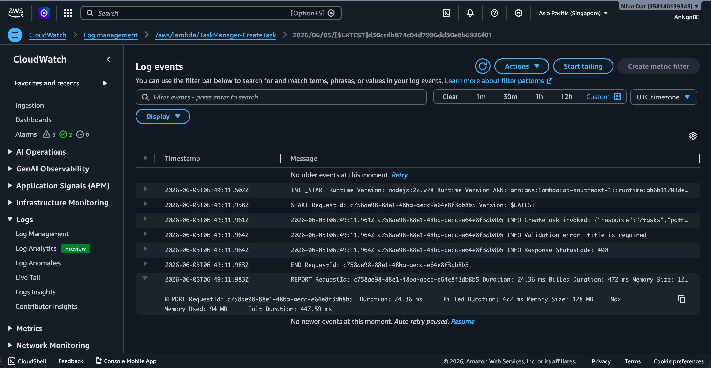

---

## PHẦN 7: TẬP HỢP BẰNG CHỨNG CỦA NGƯỜI B

| ID       | Mục bằng chứng                                  | Trạng thái    | Ghi chú                                      |
| -------- | ----------------------------------------------- | ------------- | -------------------------------------------- |
| **NE-2** | Lambda VpcConfig — Subnets + SG hiển thị        | `[x] Đã chụp` | Chụp tab Configuration > VPC của từng Lambda |
| **NE-5** | CloudWatch log — Lambda gọi DynamoDB thành công | `[x] Đã chụp` | Chụp log REPORT + StatusCode 200             |
| **IM-3** | Mỗi Lambda gắn Role đúng                        | `[x] Đã chụp` | Chụp tab Configuration > Permissions         |
| **CO-2** | API Gateway Cognito Authorizer                  | `[x] Đã chụp` | Chụp mục Authorizers                         |
